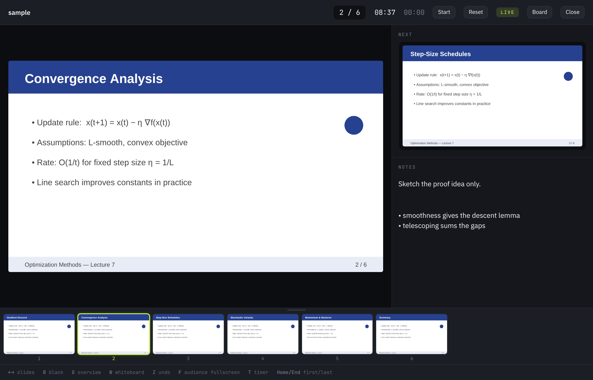
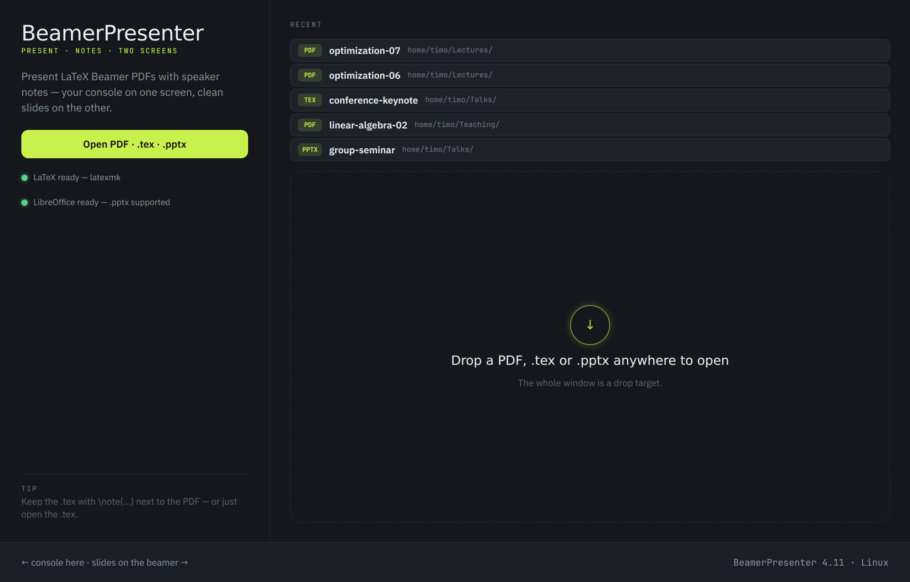
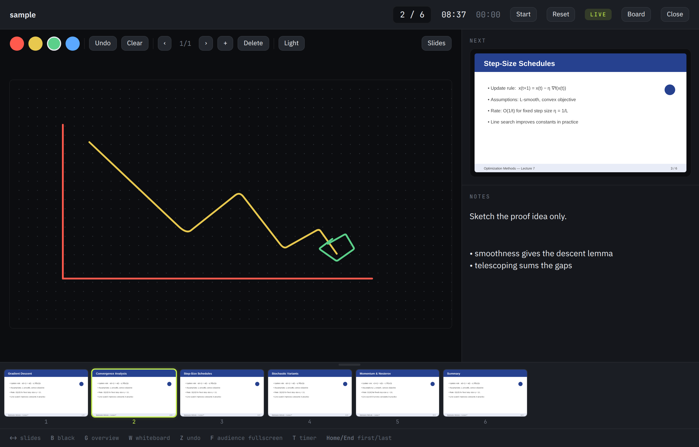
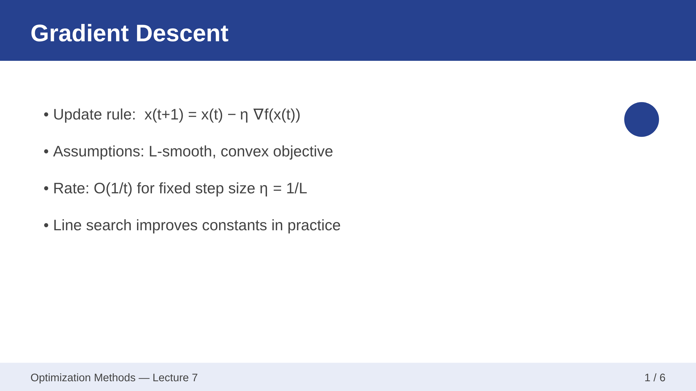
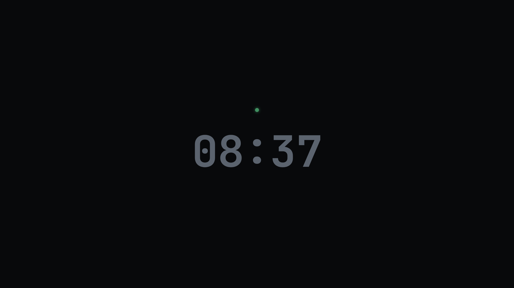

# BeamerPresenter

A native macOS (Apple Silicon) presenter app for LaTeX **Beamer** decks. The audience
screen shows the slide; your laptop shows a full presenter console: current
slide, next slide, speaker notes, a thumbnail strip, a slide overview, and a
timer.

It works directly off a compiled PDF; it can also compile a `.tex` (via a local
LaTeX install) or convert a PowerPoint `.pptx` (via LibreOffice) on the fly, and
pull speaker notes straight from the `.tex` (`\note{…}`) or from the `.pptx`
(PowerPoint speaker notes).

**Version 4.15** — see `CHANGELOG.md`. Also available: an iPad version
(`iOS/`) and a **Linux port** of the core console (`Linux/`, Tauri 2 +
WebKitGTK — see `Linux/README.md`; prebuilt `.deb` packages are attached to
the GitHub Releases, rebuilt by CI on every push to `main`).

## Screenshots

*(Captured from the Linux build — the macOS app shares the same Night
Console design.)*

The presenter console: current + next slide, speaker notes from the `.tex`,
clock/timer, and the zoomable thumbnail strip:



| Home screen | Whiteboard (live on the projector) |
| --- | --- |
|  |  |

| Audience window | Blacked out (`B`) |
| --- | --- |
|  |  |

## GUI

- **Launch splash** — shown alone at startup, then the home screen appears.
- **Menu bar** — every command lives here: *File* (Open, **Save Presentation As…**
  with ink & boards, Save Notes, Close), *Presentation* (next/previous/first/last,
  overview, blackout, black-screen presets, start/stop + reset timer), *Tools*
  (pen, laser, pen colours, undo/clear ink), *Whiteboard* (toggle, boards, add
  text/table/QR, save/insert). *App* holds About + Settings (⌘,). The
  *Presentation/Tools/Whiteboard* menus appear only while a deck is open.
- **Home screen** — open PDF/`.tex` button, a large drop zone (drop a PDF/`.tex`
  to open, or a **folder** to add it to favorites), a LaTeX **dependency status**
  (green/yellow), **favorite folders** (expand to the PDFs inside; add with the
  `+`), a recent-files list, and a bottom **dashboard** (presentations run,
  average + total time, version).
- **Menu bar icon** — a Time Machine-style status item with quick actions (open,
  show presenter, next/previous, blackout, whiteboard, settings, quit).
- **Settings (⌘,)** — open at login, show/hide the menu bar icon, **run in
  background** (menu-bar-only, no Dock icon), the default black audience screen,
  its message (with presets + clear) and a background image.

### Saving an annotated presentation

*File ▸ Save Presentation As…* writes a new PDF of the whole deck with your
freehand **ink** burned onto each slide and every **whiteboard** inserted after
the slide it was created on. It defaults to the source folder (next to the
`.tex`/`.pdf`) and afterwards reports where each board was placed.
- **Presenter console** — a centered control bar with every live tool, each a
  captioned symbol (exit, prev/next + slide counter, overview, blackout,
  whiteboard, pen, laser, the pen-colour swatches, undo/clear ink, a start/stop +
  reset **timer**, elapsed + clock),
  large current slide, next slide, notes pane, and a **scratch-notes** field
  autosaved as `<pdf>.notes.txt` (resizable, with quick-insert of time/deck/slide,
  or exported to a chosen `.txt` via its button / *File ▸ Save Notes…*). Arrow keys
  still flip slides while the notes field is focused. **Exit** (and *Close
  Presentation* / ⌘W) asks whether to go back to the **home screen** or **quit**
  the app; closing the presenter window also closes the audience window. The
  slide/sidebar and next/notes splits are **draggable** and persist. The same
  commands are also in the menu bar. The
  red close button asks first, then hides the app to the menu bar (Quit with ⌘Q).
- **Thumbnail strip** — click any slide to jump; auto-scrolls to the current one.
  **Zoomable**: drag the handle above the strip to enlarge the thumbnails
  (the size persists).
- **Resume** — reopening a deck continues on the slide you left; the position is
  remembered per file.
- **Remembered folder access** — opened files and favourite folders are stored
  as bookmarks in `~/Library/Application Support/BeamerPresenter/` and restored
  at launch, so macOS doesn't re-ask for access to the same folders.
- **Overview grid** — press `G` for a full grid of every slide; click to jump.
- **Ink & laser** — draw freehand on a slide (pen, 4 colours, undo/clear) or use
  a laser pointer (which uses the selected colour); both mirror live onto the
  audience screen.
- **Whiteboard** — press `W` for a blank white scratch slide to work through a
  calculation live. Draw on it, drop in text boxes, a clean Safari-style table
  (pick rows × columns from an Apple Notes-style grid), a QR code, or **quick
  commands** (time, deck name, slide number). Move and **resize** items with
  handles, delete any item via the red **✕** at its corner, keep several boards,
  export any of them to its own PDF, or **insert** one after the current slide
  into a *copy* of the deck PDF (the original is untouched). The board toolbar is
  a compact, Safari-like rounded bar.
- **Audience window** — full-bleed slide; opens as a normal, resizable window
  whose green button enters real macOS full screen. The borderless
  edge-to-edge fill of the external display is opt-in via *Presentation ▸
  Audience Full Screen* (or Settings) — and converts back to a normal,
  closable window automatically if the projector is unplugged. Starts
  **blacked out** by default; the black screen shows an optional centered
  message or, when empty, the clock.

## How notes work

Compile your Beamer deck so each PDF page carries the slide on the left half and
your `\note{}` text on the right half:

```latex
\documentclass{beamer}
\setbeameroption{show notes on second screen=right}

\begin{document}
\begin{frame}{Title}
  Slide content here.
  \note{These are my speaker notes for this slide.}
\end{frame}
\end{document}
```

The app detects the double-width layout automatically and splits each page:
left half → audience, right half → your notes pane.

### Notes straight from the `.tex`

You don't have to recompile with the second-screen option. If you open a plain
PDF and a `.tex` file with the **same base name** sits next to it, the app reads
your `\note{…}` text directly from the source and shows it in the notes pane.
You can also do it the other way round — **open (or drop) the `.tex` itself**. The
app opens the matching `<name>.pdf` beside it, or, if there isn't one, **compiles
it** with a detected LaTeX engine (`latexmk`/`pdflatex`). If compilation fails (or
no LaTeX is installed) it offers to open the source in an editor (Sublime Text /
VS Code / default):

```latex
\begin{frame}{Title}
  Slide content here.
  \note{These are my speaker notes for this slide.}
\end{frame}
```

If there's no `.tex` with the same base name (or it has no notes), the app falls
back to any other `.tex` in the same folder. Page mapping is exact when the
matching Beamer `.nav` file is also present (it encodes each frame's page range,
so overlays line up); otherwise each frame is treated as one page. A plain PDF
with neither notes layout nor a `.tex` still presents fine — the notes pane just
shows a hint instead.

### PowerPoint speaker notes

A `.pptx` (or `.ppt`/`.odp`) is converted to a PDF via LibreOffice on open —
and since that PDF carries only the slides, the app additionally reads the
**PowerPoint speaker notes** straight out of the `.pptx` next to it (slide
order and per-slide notes pages are resolved from the file's XML) and shows
them in the notes pane. `.tex` notes take precedence when both exist.

## Run it (development)

Requires Xcode / the Swift toolchain on macOS 13+.

```bash
cd BeamerPresenter
swift run
```

An open panel appears — pick your compiled PDF. The audience window opens as a
normal window (use its green button for full screen, or turn on the borderless
projector fill via *Presentation ▸ Audience Full Screen*).

## Keyboard / remote controls

| Key | Action |
| --- | --- |
| → / Space / Page Down | Next slide |
| ← / Page Up | Previous slide |
| Home / End | First / last slide |
| `G` | Toggle the slide overview |
| `B` | Black out the audience screen |
| `W` | Toggle the whiteboard scratch slide |
| `R` | Reset the elapsed timer |
| `P` | Pen tool |
| `L` | Laser pointer |
| `Z` | Undo last stroke |
| `C` | Clear ink on this slide |
| Esc | Drop the tool → close overview |

Bluetooth presenter remotes emit Page Up / Page Down, so they work out of the box.

## Project layout

| File | Responsibility |
| --- | --- |
| `main.swift` | AppKit bootstrap |
| `AppDelegate.swift` | Windows, screen placement, menu, keyboard |
| `PresentationState.swift` | Shared state (index, timer, blackout, overview, thumbnails) |
| `PDFModel.swift` | Loads the PDF and crops each page into halves |
| `TexNotes.swift` | Parses `\note{}` from a sibling `.tex` (+ `.nav` page ranges) |
| `PptxNotes.swift` | Reads PowerPoint speaker notes from a sibling `.pptx` |
| `AccessBookmarks.swift` | Persists file/folder access bookmarks in the config folder |
| `PDFPageView.swift` | Renders one non-interactive page (SwiftUI ↔ PDFKit) |
| `SlideView.swift` | Aspect-correct slide + ink/laser annotation layer |
| `Whiteboard.swift` | Whiteboard model, items, and QR-code generation |
| `WhiteboardView.swift` | Board rendering, item editing, toolbar, and PDF export |
| `RecentFiles.swift` | Recently-opened list persisted in UserDefaults |
| `Favorites.swift` | Favorite folders + app version info, persisted in UserDefaults |
| `Stats.swift` | Usage stats (count / total / average) for the dashboard |
| `Dependencies.swift` | Startup check for a LaTeX install (optional) |
| `WelcomeView.swift` | Home screen: open, drag-and-drop, browse folder, favorites, recents |
| `SettingsView.swift` | Settings window (start-screen folder, black-screen options) |
| `SplashView.swift` | Brief launch splash with icon + version |
| `PresenterView.swift` | Root switch + presenter console + control bar |
| `ThumbnailStrip.swift` | Clickable thumbnail navigation row |
| `OverviewGrid.swift` | Full-window slide overview overlay |
| `AudienceView.swift` | Full-bleed slide for the projector |

## Build a real `.app`

`swift run` is for iterating. To get a double-clickable bundle, run the included
script — it builds a release `arm64` binary, generates the app icon, and wraps
everything with `Info.plist`:

```bash
./build-app.sh
open build/BeamerPresenter.app
```

### Stop the repeated folder-access prompts

macOS remembers your "Allow" for Documents/Downloads/Desktop **per code
signature**. An unsigned or ad-hoc-signed build gets a new identity on every
rebuild, so the "would like to access files in your Documents folder" dialog
keeps coming back. Create a stable self-signed identity **once**:

```bash
Tools/make-signing-cert.sh   # creates "BeamerPresenter Dev" in your keychain
./build-app.sh               # picks it up automatically from now on
```

After one final prompt, macOS keeps the permission across all future rebuilds.
(If a real "Developer ID Application" or "Apple Development" identity exists
in your keychain, `build-app.sh` prefers that automatically.)

To codesign for distribution, pass your Developer ID:

```bash
./build-app.sh "Developer ID Application: Your Name (TEAMID)"
```

Then notarize with `xcrun notarytool submit build/BeamerPresenter.app --wait …`
and `xcrun stapler staple`. (You can also drop these sources into a regular
Xcode macOS App target if you prefer the Xcode toolchain.)

## App icon

The icon is drawn programmatically — no design tools or binaries needed. Edit the
shapes/colours in `Tools/make_icon.py` and run:

```bash
./make-icon.sh
```

It renders `Resources/AppIcon.iconset` (and a 1024px `Resources/AppIcon.png`
preview), then, on macOS, compiles `Resources/BeamerPresenter.icns` with the
built-in `iconutil`. `build-app.sh` does this automatically when assembling the
bundle.

## Roadmap ideas

- Embedded links and videos in the PDF
- Persisting ink between sessions
- Larger / scrollable / markdown notes via the `pdfpc` embedded-notes format
- Per-slide timing and a rehearsal mode
- Notarized release build
